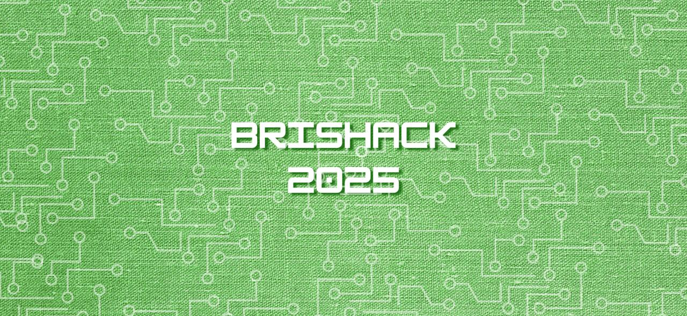

# Brishack 2025

[](https://app.netlify.com/sites/brishack2025/deploys)



Welcome to **Brishack** – a project developed for the **University of Bristol 2025 Hackathon**! This repository contains the source code and documentation for [brishack 2025](https://brishack2025.netlify.app/).

This website is created by 2024/2025 CSS webmaster [Gordon Wai Hin Kam](https://www.linkedin.com/in/gordon-kam/).

## Built With

- [Vite-React](https://vite.dev/)
- [tsparticles](https://github.com/matteobruni/tsparticles)
- [React Router DOM](https://reactrouter.com/)


### Prerequisites

- [Node.js](https://nodejs.org/) (v18.x or higher)
- [ssh](https://docs.github.com/en/authentication/connecting-to-github-with-ssh) (Use ssh to connect to github for cloning this repo)
### How to run it

1. **Clone the repository:**

   ```bash
   # via. ssh
   git clone git@github.com:cssbristol/2025.brishack.io.git 
   cd brishack
   ```

2. **Run it locally**

    ``` bash
    # install all the dependencies
    npm install
    npm run dev
    ```
    
    The website will be hosted on port (default) [5173](http://localhost:5173/), type http://localhost:5173 into your favourite browser.

## Deployment

This project is hosted on [brishack.io](https://brishack.io/)(currently domain name is expired) or use Netlify subdomain()

This project is continuously deployed via [Netlify](https://www.netlify.com/). Every push to the repository triggers an automatic deployment, and you can view the current deployment status via the badge at the top of this README.

For more details on deployment or to troubleshoot any issues, please refer to the [Netlify](https://www.netlify.com/) documentation.